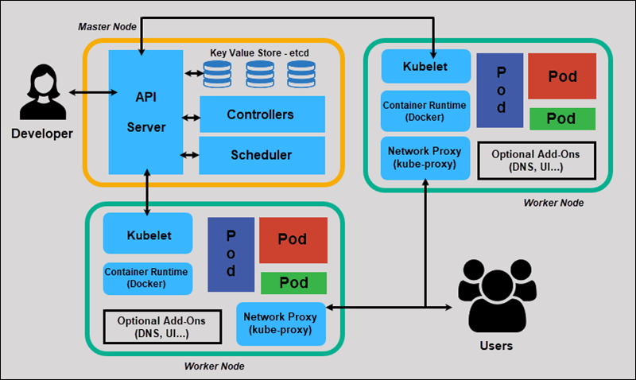

# Kubernetes

## Alguns sites que devemos visitar

- [https://kubernetes.io](https://kubernetes.io)

- [https://github.com/kubernetes/kubernetes/](https://github.com/kubernetes/kubernetes/)

- [https://12factor.net/pt_br/](https://12factor.net/pt_br/)

## Arquitetura do k8s

Assim como os demais orquestradores disponíveis, o k8s também segue um modelo *master/worker*, constituindo assim um *cluster*, onde para seu funcionamento devem existir no mínimo três nós: o nó *master*, responsável (por padrão) pelo gerenciamento do *cluster*, e os demais como *workers*, executores das aplicações que queremos executar sobre esse *cluster*.

Embora exista a exigência de no mínimo três nós para a execução do k8s em um ambiente padrão, existem soluções para se executar o k8s em um único nó. Alguns exemplos são:

* [Kind](https://kind.sigs.k8s.io/docs/user/quick-start): Uma ferramenta para execução de contêineres Docker que simulam o funcionamento de um cluster Kubernetes. É utilizado para fins didáticos, de desenvolvimento e testes. O **Kind não deve ser utilizado para produção**;

* [Minikube](https://github.com/kubernetes/minikube): ferramenta para implementar um *cluster* Kubernetes localmente com apenas um nó. Muito utilizado para fins didáticos, de desenvolvimento e testes. O **Minikube não deve ser utilizado para produção**;

* [MicroK8S](https://microk8s.io): Desenvolvido pela [Canonical](https://canonical.com), mesma empresa que desenvolve o [Ubuntu](https://ubuntu.com). Pode ser utilizado em diversas distribuições e **pode ser utilizada para ambientes de produção**, em especial para *Edge Computing* e IoT (*Internet of things*);

* [k3s](https://k3s.io): Desenvolvido pela [Rancher Labs](https://rancher.com), é um concorrente direto do MicroK8s, podendo ser executado inclusive em Raspberry Pi.

A figura a seguir mostra a arquitetura interna de componentes do k8s.

|  |
|:---------------------------------------------------------------------------------------------:|
| *Arquitetura Kubernetes [Ref: phoenixnap.com KB article](https://phoenixnap.com/kb/understanding-kubernetes-architecture-diagrams)*                                                                      |

* **API Server**: É um dos principais componentes do k8s. Este componente fornece uma API que utiliza JSON sobre HTTP para comunicação, onde para isto é utilizado principalmente o utilitário ``kubectl``, por parte dos administradores, para a comunicação com os demais nós, como mostrado no gráfico. Estas comunicações entre componentes são estabelecidas através de requisições [REST](https://restfulapi.net);

* **etcd**: O etcd é um *datastore* chave-valor distribuído que o k8s utiliza para armazenar as especificações, status e configurações do *cluster*. Todos os dados armazenados dentro do etcd são manipulados apenas através da API. Por questões de segurança, o etcd é por padrão executado apenas em nós classificados como *master* no *cluster* k8s, mas também podem ser executados em *clusters* externos, específicos para o etcd, por exemplo;

* **Scheduler**: O *scheduler* é responsável por selecionar o nó que irá hospedar um determinado *pod* (a menor unidade de um *cluster* k8s - não se preocupe sobre isso por enquanto, nós falaremos mais sobre isso mais tarde) para ser executado. Esta seleção é feita baseando-se na quantidade de recursos disponíveis em cada nó, como também no estado de cada um dos nós do *cluster*, garantindo assim que os recursos sejam bem distribuídos. Além disso, a seleção dos nós, na qual um ou mais pods serão executados, também pode levar em consideração políticas definidas pelo usuário, tais como afinidade, localização dos dados a serem lidos pelas aplicações, etc;

* **Controller Manager**: É o *controller manager* quem garante que o *cluster* esteja no último estado definido no etcd. Por exemplo: se no etcd um *deploy* está configurado para possuir dez réplicas de um *pod*, é o *controller manager* quem irá verificar se o estado atual do *cluster* corresponde a este estado e, em caso negativo, procurará conciliar ambos;

* **Kubelet**: O *kubelet* pode ser visto como o agente do k8s que é executado nos nós workers. Em cada nó worker deverá existir um agente Kubelet em execução. O Kubelet é responsável por de fato gerenciar os *pods*, que foram direcionados pelo *controller* do *cluster*, dentro dos nós, de forma que para isto o Kubelet pode iniciar, parar e manter os contêineres e os pods em funcionamento de acordo com o instruído pelo controlador do cluster;

* **Kube-proxy**: Age como um *proxy* e um *load balancer*. Este componente é responsável por efetuar roteamento de requisições para os *pods* corretos, como também por cuidar da parte de rede do nó;

* **Container Runtime**: O *container runtime* é o ambiente de execução de contêineres necessário para o funcionamento do k8s. Em 2016 suporte ao [rkt](https://coreos.com/rkt/) foi adicionado, porém desde o início o Docker já é funcional e utilizado por padrão.

## Portas que devemos nos preocupar

**MASTER**

Protocol|Direction|Port Range|Purpose|Used By
--------|---------|----------|-------|-------
TCP|Inbound|6443*|Kubernetes API server|All
TCP|Inbound|2379-2380|etcd server client API|kube-apiserver, etcd
TCP|Inbound|10250|Kubelet API|Self, Control plane
TCP|Inbound|10251|kube-scheduler|Self
TCP|Inbound|10252|kube-controller-manager|Self

* Toda porta marcada por * é customizável, você precisa se certificar que a porta alterada também esteja aberta.

**WORKERS**

Protocol|Direction|Port Range|Purpose|Used By
--------|---------|----------|-------|-------
TCP|Inbound|10250|Kubelet API|Self, Control plane
TCP|Inbound|30000-32767|NodePort|Services All

Caso você opte pelo [Weave](https://weave.works) como *pod network*, devem ser liberadas também as portas 6783 e 6784 TCP.

## Tá, mas qual tipo de aplicação eu devo rodar sobre o k8s?

O melhor *app* para executar em contêiner, principalmente no k8s, são aplicações que seguem o [The Twelve-Factor App](https://12factor.net/pt_br/).

## Conceitos-chave do k8s

É importante saber que a forma como o k8s gerencia os contêineres é ligeiramente diferente de outros orquestradores, como o Docker Swarm, sobretudo devido ao fato de que ele não trata os contêineres diretamente, mas sim através de *pods*. Vamos conhecer alguns dos principais conceitos que envolvem o k8s a seguir:

- **Pod**: é o menor objeto do k8s. Como dito anteriormente, o k8s não trabalha com os contêineres diretamente, mas organiza-os dentro de *pods*, que são abstrações que dividem os mesmos recursos, como endereços, volumes, ciclos de CPU e memória. Um pod, embora não seja comum, pode possuir vários contêineres;

- **Controller**: é o objeto responsável por interagir com o *API Server* e orquestrar algum outro objeto. Exemplos de objetos desta classe são os *Deployments* e *Replication Controllers*;

- **ReplicaSets**: é um objeto responsável por garantir a quantidade de pods em execução no nó;

- **Deployment**: É um dos principais *controllers* utilizados. O *Deployment*, em conjunto com o *ReplicaSet*, garante que determinado número de réplicas de um pod esteja em execução nos nós workers do cluster. Além disso, o Deployment também é responsável por gerenciar o ciclo de vida das aplicações, onde características associadas a aplicação, tais como imagem, porta, volumes e variáveis de ambiente, podem ser especificados em arquivos do tipo *yaml* ou *json* para posteriormente serem passados como parâmetro para o ``kubectl`` executar o deployment. Esta ação pode ser executada tanto para criação quanto para atualização e remoção do deployment;

- **Jobs e CronJobs**: são objetos responsáveis pelo gerenciamento de jobs isolados ou recorrentes.

## Campos necessários para um manifesto

- Você deve criar um arquivo .yaml para criar objetos no K8S, você irá precisar criar pelo menos os valores do campo a baixo:

apiVersion - Qual versão do api kubernetes você está usando pra criar o objeto.
kind - qual tipo de recurso você deseja criar
metadata - Ele ajuda a depois você identificar o seu objeto, including a name string, UID, and optional namespace
spec - Qual estado você deseja para o seu objeto