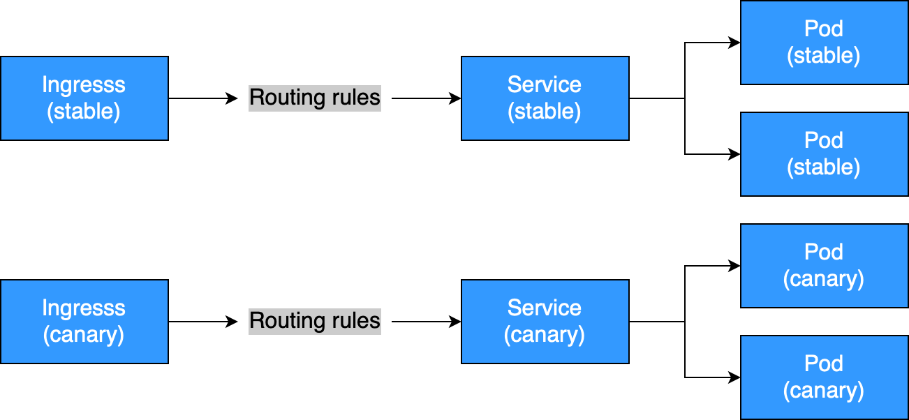

# Deployments

O **Deployment** é um recurso com a responsabilidade de instruir o Kubernetes a criar, atualizar e monitorar a saúde dos Pods de suas aplicações.

Um Deployment é o responsável por gerenciar o seu **ReplicaSet** , ou seja, o Deployment é quem vai determinar a configuração de sua aplicação e como ela será implementada. O Deployment é o **controller** que irá cuidar, por exemplo, uma instância de sua aplicação por algum motivo for interrompida. 

Podemos criar nossos deployments a partir do template:

```
kubectl create deployment --dry-run=client -o yaml --image=nginx nginx-template > primeiro-deployment-template.yaml
ou
kubectl-example deployment > primeiro-deployment-template.yaml
```
- primeiro-deployment-template.yaml
  
```yaml
apiVersion: apps/v1
kind: Deployment
metadata:
  labels:
    app: nginx-template
  name: nginx-template
spec:
  replicas: 1
  selector:
    matchLabels:
      app: nginx-template
  strategy: {}
  template:
    metadata:
      labels:
        app: nginx-template
    spec:
      containers:
      - image: nginx
        name: nginx
        resources: {}
status: {}
```
- No Campo **.spec.selector** você define quais pods o deployment irá gerenciar, nesse caso ele irá dar machlabel en tudo que for app: nginx-template. Porém conseguimos fazer seleções mais sofisticadas também. Se atentar para que os rótulos de um deployment não sobreponham de outros, para não termos comportamentos inesperados.
- no deployment conseguimos usar também todos os recursos que são usados em um pod, como initcontainer, liveness e etc.
```
kubectl create -f primeiro-deployment.yaml

deployment.extensions/primeiro-deployment created
```
Visualizando os deployments:

```
kubectl get deployment

NAME                DESIRED   CURRENT   UP-TO-DATE   AVAILABLE   AGE
primeiro-deployment  1         1         1            1           6m
segundo-deployment   1         1         1            1           1m
```

Visualizando os detalhes do ``pod`` criado a partir do **primeiro deployment**:

```
kubectl describe pod primeiro-deployment-68c9dbf8b8-kjqpt

kubectl describe deployment primeiro-deployment
```

## Canary deployments
### Usando Service
- o deploy canário pode ser feito também usando service e labels.
EX:
  - Você cria dois deployments, com as mesmas tags e referencia no service essa tag como selector. Define a porcentagem a partir das réplicas.

- deploy1
```yaml
     name: frontend
     replicas: 3
     ...
     labels:
        app: guestbook
        tier: frontend
        track: stable
     ...
     image: gb-frontend:v3
```

- deploy-canary
```yaml
     name: frontend-canary
     replicas: 1
     ...
     labels:
        app: guestbook
        tier: frontend
        track: canary
     ...
     image: gb-frontend:v4
```

- service
```yaml
  selector:
     app: guestbook
     tier: frontend
```
- Exemplo de manifestos: https://github.com/Mourahumberto/Containers/tree/main/kubernetes/manifest/deploy-canary

### Usando Ingress
- Podemos fazer deploy canário utilizando o nginx ingress criando dois ingress distintos apontando pra dois services
|  |
|:---------------------------------------------------------------------------------------------:|

## Node Selector

O **Node Selector** é uma forma de classificar nossos nodes como por exemplo nosso node ``elliot-02`` que possui disco **SSD** e está localizado no DataCenter ``UK``, e o node ``elliot-03`` que possui disco **HDD** e está localizado no DataCenter ``Netherlands``.

Agora que temos essas informações vamos criar essas labels em nossos nodes, para utilizar o ``nodeSelector``.

Criando a label ``disk`` com o valor ``SSD`` no worker 1:

```
kubectl label node elliot-02 disk=SSD

node/elliot-02 labeled
```

Criando a label ``env`` com o valor ``prod`` no worker 1:

```
kubectl label node elliot-02 env=prod

node/elliot-02 labeled
```

Criando a label ``env`` com o valor ``qa`` no worker 2:

```
kubectl label node elliot-03 env=qa
node/elliot-03 labeled
```

Criando a label ``disk`` com o valor ``hdd`` no worker 2:

```
kubectl label nodes elliot-03 disk=hdd

node/elliot-03 labeled
```

Opa! Acabamos declarando o ``disk=hdd`` em letra minúscula, como arrumamos isso? Subscrevendo a label como no comando a seguir.

```
kubectl label nodes elliot-03 disk=HDD --overwrite

node/elliot-03 labeled
```

Para saber as labels configuradas em cada node basta executar o seguinte comando:

No worker 1:

```
kubectl label nodes elliot-02 --list

env=prod
disk=SSD
kubernetes.io/hostname=elliot-02
beta.kubernetes.io/arch=amd64
beta.kubernetes.io/os=linux
```

No worker 2:

```
kubectl label nodes elliot-03 --list

beta.kubernetes.io/os=linux
env=qa
disk=HDD
kubernetes.io/hostname=elliot-03
beta.kubernetes.io/arch=amd64
```

Agora, basta realizar o deploy novamente, porém antes vamos adicionar duas novas opções ao YAML e vamos ver a mágica acontecer. O nosso pod irá ser criado no node ``elliot-02``, onde possui a label ``disk=SSD``.

Crie o arquivo ``terceiro-deployment.yaml``:

```
vim terceiro-deployment.yaml
```

Informe o seguinte conteúdo:

```yaml
apiVersion: apps/v1
kind: Deployment
metadata:
  labels:
    run: nginx
  name: terceiro-deployment
  namespace: default
spec:
  replicas: 1
  selector:
    matchLabels:
      run: nginx
  template:
    metadata:
      creationTimestamp: null
      labels:
        run: nginx
        env: qa
    spec:
      containers:
      - image: nginx
        imagePullPolicy: Always
        name: nginx2
        ports:
        - containerPort: 80
          protocol: TCP
        resources: {}
        terminationMessagePath: /dev/termination-log
        terminationMessagePolicy: File
      dnsPolicy: ClusterFirst
      restartPolicy: Always
      schedulerName: default-scheduler
      securityContext: {}
      terminationGracePeriodSeconds: 30
      nodeSelector:
        disk: SSD
```

Crie o deployment a partir do manifesto:

```
kubectl create -f terceiro-deployment.yaml

deployment.extensions/terceiro-deployment created
```

Visualizando os detalhes dos pods:

```
kubectl get pods -o wide

NAME                        READY STATUS  RESTARTS  AGE  IP           NODE
primeiro-deployment-56d9... 1/1   Running  0      14m  172.17.0.4 elliot-03
segundo-deployment-869f...  1/1   Running  0      14m  172.17.0.5 elliot-03
terceiro-deployment-59cd... 1/1   Running  0      22s  172.17.0.6 elliot-02
```

Removendo a label ``env`` de um node worker:

```
kubectl label nodes elliot-02 env-
```

Removendo uma determinada label de todos os nodes:

```
kubectl label nodes --all env-
```

Agora imagine as infinitas possibilidades que isso poderá lhe proporcionar… Já estou pensando em várias, como por exemplo se é produção ou não, se consome muita CPU ou muita RAM, se precisa estar em determinado rack e por aí vai. 😃

Simples como voar, não?

# ReplicaSet

O **ReplicaSet** garante a quantidade solicitada de pods e os recursos necessários para um Deployment. Uma vez que o Deployment é criado, é o ReplicaSet que controla a quantidade de pods em execução, caso algum pod seja finalizado, ele que irá detectar e solicitar que outro pod seja executado em seu lugar, garantindo assim a quantidade de réplicas solicitadas.

Caso você delete um Pod ou o worker que ele esteja fique down, o replicaset irá se incarregar de subir outro pod.

# DaemonSet

**DaemonSet** é basicamente a mesma coisa do que o ReplicaSet, com a diferença que quando você utiliza o DaemonSet você não especifica o número de réplicas, ele subirá um pod por node em seu cluster.

É sempre interessante quando criar usar e abusar das labels, assim você conseguirá ter melhor flexibilidade na distribuição mais adequada de sua aplicação.

Ele é bem interessante para serviços que necessitem rodar em todos os nodes do cluster, como por exemplo, coletores de logs e agentes de monitoração.

# Rollouts e Rollbacks

**CRIAR**
