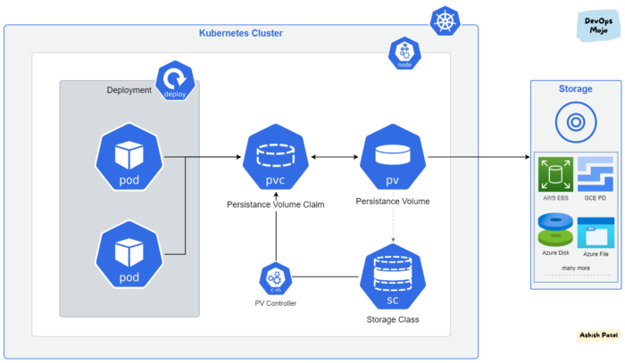

# Volumes

Os Discos no container é ephemero. No caso quando um pod é restartado o pod volta ao estado inicial do seu storage.
Porém os Persistents volumes existem para que o volume existe independente do tempo de vida de um pod.
Tipos de volumes: ``https://kubernetes.io/docs/concepts/storage/volumes/``

## Types of Volumes
Kubernetes supports several types of volumes.
- awsElasticBlockStore
- zureFile
- cephfs
- cinder
- configMap
- downwardAPI
- emptyDir
- fc (fibre channel)
- flocker (deprecated)
- gcePersistentDisk
- gitRepo (deprecated)
- glusterfs
- hostPath
- iscsi
- local
- nfs
- persistentVolumeClaim
- portworxVolume
- projected
- quobyte (deprecated)
- rbd
- secret
- storageOS (deprecated)
- vsphereVolume

## Access Modes
 - ReadWriteOnce(RWO) — volume can be mounted as read-write by a single node.
 - ReadOnlyMany(ROX) — volume can be mounted read-only by many nodes.
 - ReadWriteMany(RWX) — volume can be mounted as read-write by many nodes.
 - ReadWriteOncePod(RWOP) — volume can be mounted as read-write by a single Pod.

## Persistent Volumes
- Um **PersistentVolume (PV)** é uma parte do armazenamento no cluster que foi provisionado por um administrador ou provisionado dinamicamente usando **storage class**. O PV é um recurso assim como um nó e tem um ciclo de vida independente de um pod.
- PV não precisa de namespace, logo são acessiveis em todo o cluster e em todos os namespaces.
- Ao contrário do Volumes, o ciclo de vida dos PVs é gerenciado pelo Kubernetes.

## Persistent Volume Clain
- Um **PersistentVolumeClaim (PVC)** é um requerimento de recurso do storage feito pelo usuário. é similar a um pod "pedindo" recurso para um nó. os PVC's consomem o PV.
- Um PVC é a ligação do pod ao PV
- Um PVC descreve a capacidade e as caracteristicas do disco necessárias para o pod, e o cluster tenta ligar esse e provisionar esse PV.
- O PVC deve estar no mesmo namespace do pod, e os clains podem especificar o tamanho e o access mode.
### Access Modes
 - ReadWriteOnce(RWO) — volume can be mounted as read-write by a single node.
 - ReadOnlyMany(ROX) — volume can be mounted read-only by many nodes.
 - ReadWriteMany(RWX) — volume can be mounted as read-write by many nodes.
 - ReadWriteOncePod(RWOP) — volume can be mounted as read-write by a single Pod.


## Storage Class
- Um **Storage Class** é uma forma dinâmica de provisionar volumes persistentes. Ele é usado em conjunto com um pvc para que pods façam requisição de novos storages.
- Storage class usa provisioners que são específicos de cada cloud provide, que dão ao kubernetes acesso ao storage físico.

- forma para ver qual storage class é criado no seu cloud provider.
```$ kubectl get storageclasses.storage.k8s.io```


A figura a seguir mostra a arquitetura de PVC, PV e storage class.

|  |
|:---------------------------------------------------------------------------------------------:|
| *Arquitetura Kubernetes Volumes  [Ref: Ashish Patel KB article](https://medium.com/devops-mojo/kubernetes-storage-options-overview-persistent-volumes-pv-claims-pvc-and-storageclass-sc-k8s-storage-df71ca0fccc3)*

### Exemplos de PVC usando storage class RWO
https://github.com/Mourahumberto/Containers/blob/main/kubernetes/manifest/site-pvc/site-pvc.yaml

### Exemplos de PVC usando storage class RWX
- Siga a Doc caso for usar o efs: https://docs.aws.amazon.com/eks/latest/userguide/efs-csi.html
e aplique : https://github.com/Mourahumberto/Containers/blob/main/kubernetes/manifest/site-pvc/site-pvc-efs.yaml

### Usando o rook para criação de shared-storage e NFS
 Doc : https://rook.io/docs/rook/v1.8/quickstart.html

# Volumes


## Empty-Dir

Um volume do tipo **EmptyDir** é criado sempre que um Pod é atribuído a um nó existente. Esse volume é criado inicialmente vazio, e todos os contêineres do Pod podem ler e gravar arquivos no volume.

Esse volume não é um volume com persistência de dados. Sempre que o Pod é removido de um nó, os dados no ``EmptyDir`` são excluídos permanentemente. É importante ressaltar que os dados não são excluídos em casos de falhas nos contêineres.

Vamos criar um Pod para testar esse volume:

```
vim pod-emptydir.yaml
```

Informe o seguinte conteúdo:

```yaml
apiVersion: v1
kind: Pod
metadata:
  name: busybox
  namespace: default
spec:
  containers:
  - image: busybox
    name: busy
    command:
      - sleep
      - "3600"
    volumeMounts:
    - mountPath: /giropops
      name: giropops-dir
  volumes:
  - name: giropops-dir
    emptyDir: {}
```

Crie o volume a partir do manifesto.

```
kubectl create -f pod-emptydir.yaml

pod/busybox created
```

Visualize os pods:

```
kubectl get pod

NAME                      READY     STATUS    RESTARTS   AGE
busybox                   1/1       Running   0          12s
```

Pronto! Já subimos nosso pod.

Vamos listar o nome do contêiner que está dentro do pod ``busybox``:

```
kubectl get pods busybox -n default -o jsonpath='{.spec.containers[*].name}*'

busy
```

Agora vamos adicionar um arquivo dentro do path ``/giropops`` diretamente no Pod criado:

```
kubectl exec -ti busybox -c busy -- touch /giropops/funciona
```

Agora vamos listar esse diretório:

```
kubectl exec -ti busybox -c busy -- ls -l /giropops/

total 0
-rw-r--r--    1 root     root             0 Jul  7 17:37 funciona
```

Como podemos observar nosso arquivo foi criado corretamente. Vamos verificar se esse arquivo também foi criado no volume gerenciado pelo ``kubelet``. Para isso precisamos descobrir em qual nó está alocado o Pod.

```
kubectl get pod -o wide

NAME     READY     STATUS    RESTARTS   AGE  IP          NODE
busybox  1/1       Running   0          1m   10.40.0.6   elliot-02
```

Vamos acessar o shell do contêiner ``busy``, que está dentro do pod ``busybox``:

```
kubectl exec -ti busybox -c busy sh
```

Liste o conteúdo do diretório ``giropops``.

```
ls giropops
```

Agora vamos sair do Pod e procurar o nosso volume dentro do nó ``elliot-02``. Para isso acesse-o node via SSH e, em seguida, execute o comando:

```
find /var/lib/kubelet/pods/ -iname giropops-dir

/var/lib/kubelet/pods/7d33810f-8215-11e8-b889-42010a8a0002/volumes/kubernetes.io~empty-dir/giropops-dir
```

Vamos listar esse ``Path``:

```
ls /var/lib/kubelet/pods/7d33810f-8215-11e8-b889-42010a8a0002/volumes/kubernetes.io~empty-dir/giropops-dir
funciona
```

O arquivo que criamos dentro do contêiner está listado.

De volta ao nó ``elliot-01``, vamos para remover o Pod e listar novamente o diretório.

```
kubectl delete -f pod-emptydir.yaml

pod "busybox" deleted
```

Volte a acessar o nó ``elliot-02`` e veja se o volume ainda existe:

```
ls /var/lib/kubelet/pods/7d...kubernetes.io~empty-dir/giropops-dir

No such file or directory
```

Opa, recebemos a mensagem de que o diretório não pode ser encontrado, exatamente o que esperamos correto? Porque o volume do tipo **EmptyDir** não mantém os dados persistentes.