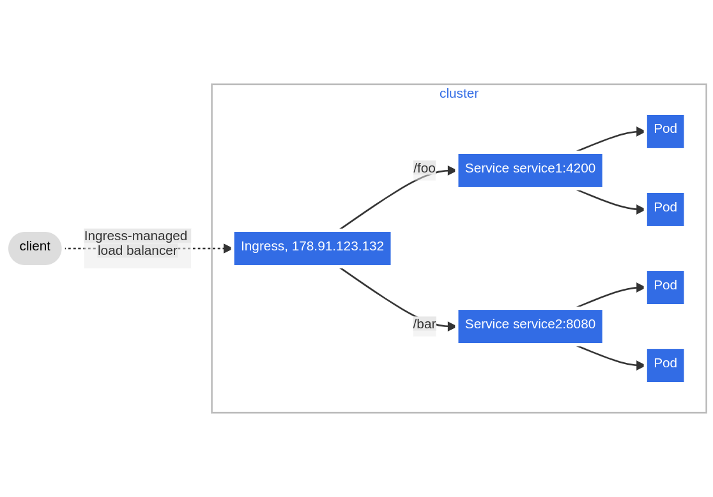
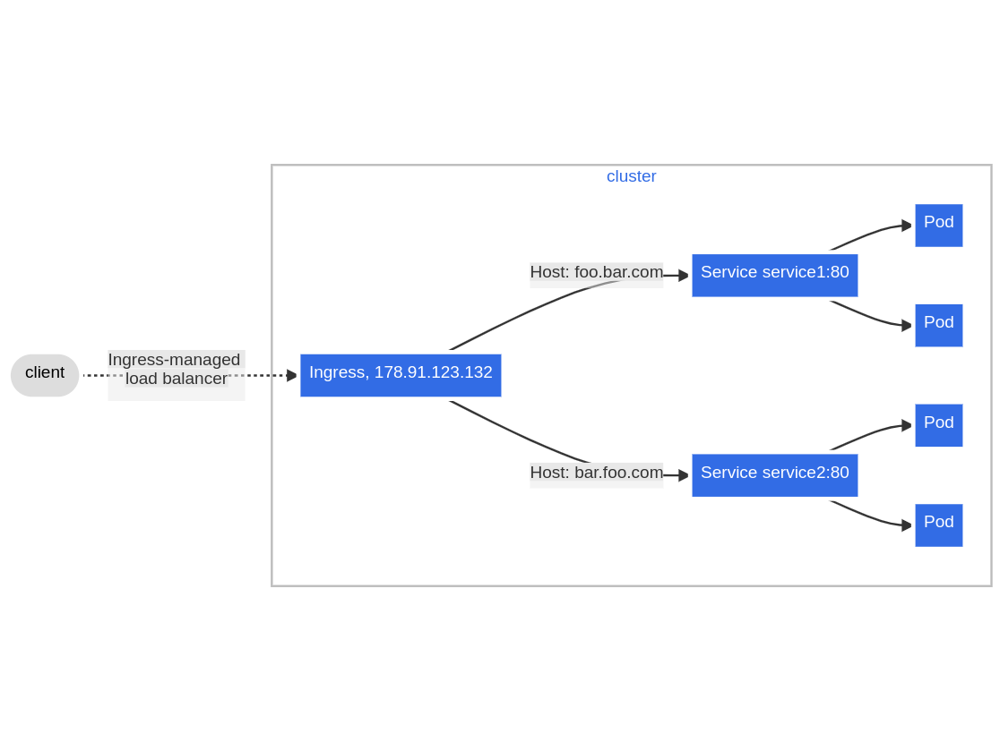

# Ingress
- É uma forma de expor suas app para fora do cluster, com várias formas de roteamento e ssl/tls, e com uso de dns.
- O resource ingress não tem finaidade se não ouver um ingress controler: https://kubernetes.io/docs/concepts/services-networking/ingress-controllers/
- Helm de como instalar ingress na AWS [DOC](../../helm/nginx/README.md)
- Instalando com manifesto ingress na AWS [DOC](../k8s-extend/nginx/README.md)

EX: simples usando nginx Ingress
```yaml
apiVersion: networking.k8s.io/v1
kind: Ingress
metadata:
  name: minimal-ingress
  annotations:
    nginx.ingress.kubernetes.io/rewrite-target: /
spec:
  ingressClassName: nginx
  rules:
  - http:
      paths:
      - path: /testpath
        pathType: Prefix
        backend:
          service:
            name: test
            port:
              number: 80
```
- Cada Ingress tem suas annotations verificar em suas documentações.
- Se o ingressClassName for omitido ele pegará o default que pode ser visto $ kubectl get ingressclasses

### Redirects
- existem várias formas de fazer redirect no ingress
- Path tyes: https://kubernetes.io/docs/concepts/services-networking/ingress/#path-types
- hostname wildcards: https://kubernetes.io/docs/concepts/services-networking/ingress/#hostname-wildcards
- Docs Legais
  - [Path matching with regex](https://docs.nginx.com/nginx-ingress-controller/tutorials/ingress-path-regex-annotation/)
  - [Full URL Path Preservation](https://medium.com/@megaurav25/url-redirection-with-full-url-path-preservation-using-ingress-nginx-493f18523c99)
  - [Multi Paths](https://devpress.csdn.net/cloud/62fcb352c677032930801ba6.html)
  - [Multi Paths and ingress](https://copyprogramming.com/howto/kubernetes-ingress-with-multiple-target-rewrite)
  - [rewrite nginx doc](https://kubernetes.github.io/ingress-nginx/examples/rewrite/)


### Ingress class
- O kubernetes pode ter multiplos ingress controllers, e você pode especificar cada um com o ingress-class
- você pode definir um dos ingress crontolers como default usando a anotation     ingressclass.kubernetes.io/is-default-class: "true"

### exemplos de ingress e redirects

ex1:
- Criação de ingress pra dois paths
|  |
|:---------------------------------------------------------------------------------------------:|

```yaml
apiVersion: networking.k8s.io/v1
kind: Ingress
metadata:
  name: simple-fanout-example
spec:
  rules:
  - host: foo.bar.com
    http:
      paths:
      - path: /foo
        pathType: Prefix
        backend:
          service:
            name: service1
            port:
              number: 4200
      - path: /bar
        pathType: Prefix
        backend:
          service:
            name: service2
            port:
              number: 8080
```

ex2:
- diferente hosts
|  |
|:---------------------------------------------------------------------------------------------:|

```yaml
apiVersion: networking.k8s.io/v1
kind: Ingress
metadata:
  name: name-virtual-host-ingress
spec:
  rules:
  - host: foo.bar.com
    http:
      paths:
      - pathType: Prefix
        path: "/"
        backend:
          service:
            name: service1
            port:
              number: 80
  - host: bar.foo.com
    http:
      paths:
      - pathType: Prefix
        path: "/"
        backend:
          service:
            name: service2
            port:
              number: 80
```

## TLS
- existem várias formas de referenciar seu certificado em vários providers e ingress controllers diferents, mas vamos ver um exemplo.
- 
```yaml
apiVersion: v1
kind: Secret
metadata:
  name: testsecret-tls
  namespace: default
data:
  tls.crt: base64 encoded cert
  tls.key: base64 encoded key
type: kubernetes.io/tls
```
```yaml
apiVersion: networking.k8s.io/v1
kind: Ingress
metadata:
  name: tls-example-ingress
spec:
  tls:
  - hosts:
      - https-example.foo.com
    secretName: testsecret-tls
  rules:
  - host: https-example.foo.com
    http:
      paths:
      - path: /
        pathType: Prefix
        backend:
          service:
            name: service1
            port:
              number: 80
```


